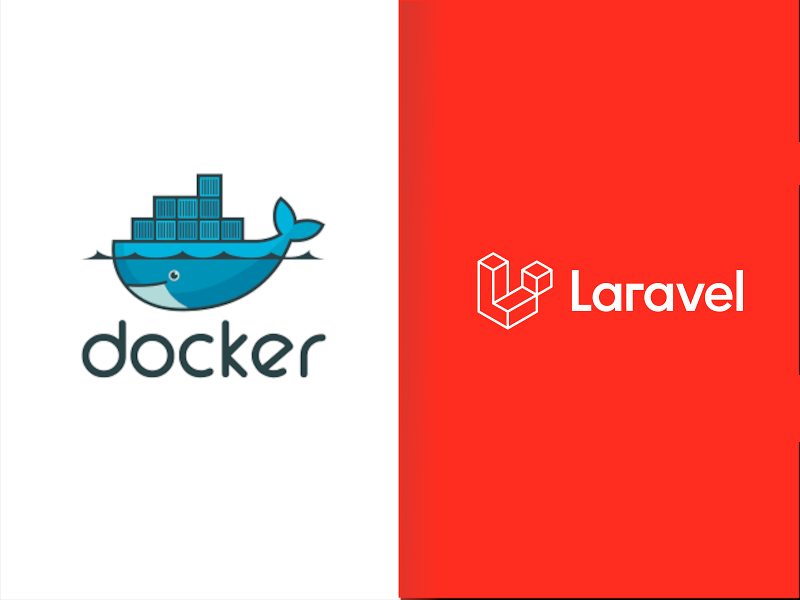
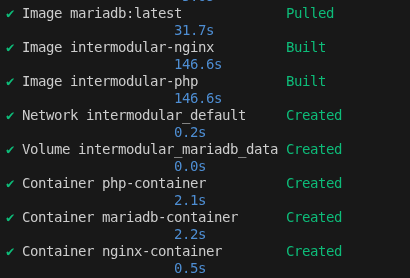
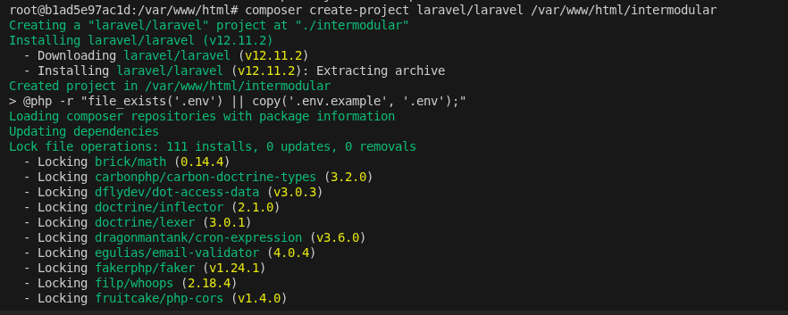
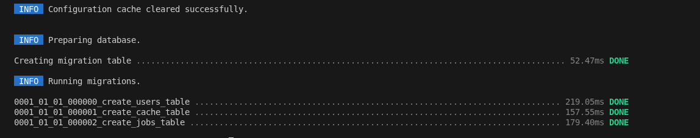
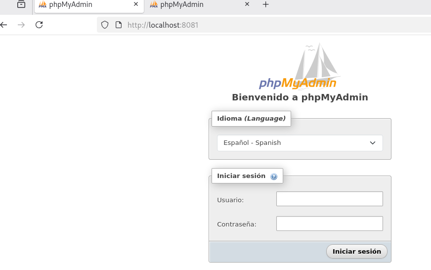
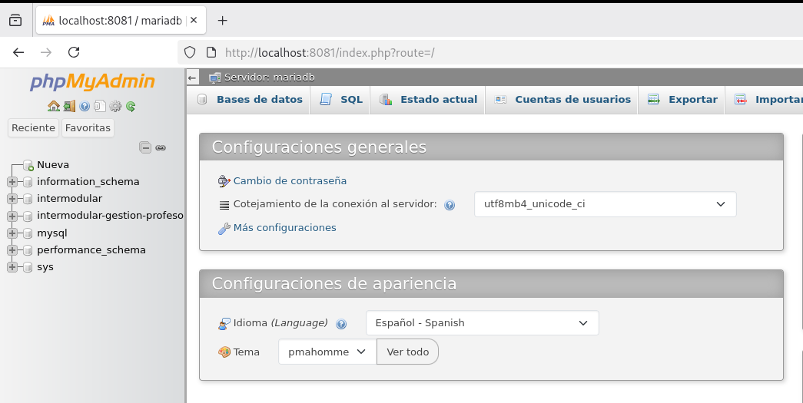

## Índice
1. [estructura de directorios](#estructura-de-directorios)

2. [Configuracion de nginx](#configuracion-nginx)
3. [Configuraciom maria db](#configuracion-maria-db)
4. [Archivo compose-yml](#archivo-compose-yml)
---

## Indice

5. [Pagina de prueba php](#pagina-de-prueba-php)
6. [Construir y ejecutar contenedores]( #construir-y-ejecutar-los-contenedores)
7. [Verficar base de datos](#7-verificar-la-base-de-datos)
8. [Instalacion Composer](#8-instalacion-composer)

9. [Creacion proyecto laravel](#9-creacion-proyecto-laravel)
10. [Configurar phpMyAdmin](#10-configurar-phpmyadmin)
---


## Estructura de directorios
<!--  -->
creamos las carpetas y ficheros

```bash
mkdir -p practica6-2/nginx
mkdir -p practica6-2/php
mkdir -p practica6-2/mariadb
mkdir -p practica6-2/www/html
```

 ```bash
touch practica6-2/docker-compose.yml
touch practica6-2/nginx/default.conf
touch practica6-2/php/Dockerfile
touch practica6-2/mariadb/init.sql
touch practica6-2/www/html/index.php
 ``` 
---
<!--  -->

## Configuracion nginx

```bash
vim default.conf
```
---
```nginx
   server {
 listen 80 default_server;
 root /var/www/html;
 index index.php;
 location / {
 try_files $uri $uri/ /index.php?$query_string;
 }
 location ~ \.php$ {
 fastcgi_split_path_info ^(.+\.php)(/.+)$;
 fastcgi_pass php:9000;
 fastcgi_index index.php;
 include fastcgi_params;
 fastcgi_param SCRIPT_FILENAME $document_root$fastcgi_script_name;
 }
} 
```
---
<!--  -->

## Configuracion nginx

Dockerfile nginx

```bash
 touch Dockerfile
```

```yml
FROM nginx:latest
# Actualiza los paquetes del sistema
RUN apt-get update && apt-get upgrade -y && apt-get clean
COPY ./default.conf /etc/nginx/conf.d/default.conf

```
---
<!--  -->

## Configuracion nginx

Dockerfile php

```yml
FROM php:8.2-fpm

# Instalar dependencias del sistema
RUN apt-get update && apt-get install -y \
    zip \
    unzip \
    git \
    mariadb-client \
    curl \
    
```
---
<!--  -->

## Configuracion nginx

```yml
&& docker-php-ext-install pdo pdo_mysql \
    && apt-get clean \
    && rm -rf /var/lib/apt/lists/*

# Instalar Composer
RUN curl -sS https://getcomposer.org/installer | php && \
    mv composer.phar /usr/local/bin/composer

```
---
## Configuracion maria DB
instalamos mariadb
```bash
 apt install mariadb-server mariadb-client galera-4
```

---
## Configuracion maria DB

```bash
 mariadb-secure-installation
```

Creamos la base de datos creamos un usuario con usuario y contraseña y le damos todos los permisos

```sql
CREATE DATABASE intermodular;
CREATE USER 'laravel_user'@'%' IDENTIFIED BY 'laravel_password';
GRANT ALL PRIVILEGES ON intermodular.* TO 'laravel_user'@'%';
FLUSH PRIVILEGES;
```
---
## Archivo compose yml


```yml
services: # todos los servicios que tendremos
  nginx: # servico de nginx
  build: ./nginx # cojeremos la configuracion de nuestra carpeta nginx
  container_name: nginx-container # nombre que usaremos para ejecutar el contenedor
  ports: # mapeamos los puertos el 80 de nuestra maquina virtual sera el 80 del docker
  - "80:80"
  volumes: # guardaremos la informacion de manera persistente aqui
  - ./www/html:/var/www/html
  depends_on: # 
  - php

```
---
## Archivo compose yml

```yml
php:
 build: ./php
 container_name: php-container
 expose: # abrimos el puerto 9000 para ver nuestra pagina web
 - "9000"
 volumes:
 - ./www/html:/var/www/html
```

---

## Archivo compose yml

```yml
mariadb: # nombre del servicio
 image: mariadb:latest # descargamos la imagen de maria db
 container_name: mariadb-container 
 environment:
 MYSQL_ROOT_PASSWORD: root_password
 MYSQL_DATABASE: intermodular
 MYSQL_USER: laravel_user
 MYSQL_PASSWORD: laravel_password
```
--- 
## Archivo compose yml

```yml
volumes:
 # Volumen persistente para los datos de la base de datos
 - mariadb_data:/var/lib/mysql
 # Volumen para scripts de inicialización
 - ./mariadb:/docker-entrypoint-initdb.d
 ports:
 - "3306:3306"
# Declaración de volúmenes persistentes
volumes:
 mariadb_data:
```
---
## Pagina de prueba php
 Creamos el archivo www/html/index.php

 ```php
 <?php
$host = 'mariadb';
$db = 'intermodular';
$user = 'laravel_user';
$password = 'laravel_password';
try {
 $pdo = new PDO("mysql:host=$host;dbname=$db", $user, $password);
 echo "<h1>Conexión exitosa a MariaDB</h1>";
} catch (PDOException $e) {
 echo "<h1>Error: " . $e->getMessage() . "</h1>";
}
?>
 ```
 ---

 ## Construir y ejecutar los contenedores 

```bash
cd /home/cesar-debian/intermodular
docker-compose up --build -d
```
---
 ## Construir y ejecutar los contenedores 

<!--  -->

---

---
## Paso 7 Verificar la base de datos

Entramos al contenedor para instalar composer
```bash
docker exec -it php-container bash
```
---
## 7 Verificar la base de datos

Entramos en mysql
```bash
mysql -h mariadb -u laravel_user -p
# - h nombre de servicio
# - u usuario 
# - p contraseña
```

---
## 8 Instalacion Composer

```bash
curl -sS https://getcomposer.org/installer | php
```
```bash
 mv composer.phar /usr/local/bin/composer
```
Verificar composer
```bash
composer -v
```

---
## 9 Creacion proyecto laravel

```bash
composer create-project laravel/laravel /var/www/html/intermodular
```


---

## 9 Creacion proyecto laravel

editamos el .env

```env
DB_CONNECTION=mysql
DB_HOST=mariadb
DB_PORT=3306
DB_DATABASE=intermodular
DB_USERNAME=laravel_user
DB_PASSWORD=laravel_password

```
---
1.Configuracion de permisos 

```bash
chmod -R 775 /var/www/html/intermodular/storage /var/www/html/intermodular/bootstrap/cache
```
```bash
sudo chown -R www-data:www-data /var/www/html/intermodular
```
---

Generamos la clave para laravel

```bash
php artisan key:generate
```
Añadimos la configuracion de la DB
```env
DB_CONNECTION=mysql
DB_HOST=mariadb
DB_PORT=3306
DB_DATABASE=intermodular
DB_USERNAME=laravel_user
DB_PASSWORD=laravel_password
```

---

Ejecutamos la migracion 

```
php artisan migrate
```


---

Apuntamos el Nginx al directorio del intermodular

```bash
server {
    listen 80 default_server;
    root /var/www/html/intermodular/public;
    index index.php;

    location / {
        try_files $uri $uri/ /index.php?$query_string;
    }

    location ~ \.php$ {
        fastcgi_split_path_info ^(.+\.php)(/.+)$;
        fastcgi_pass php:9000;
        fastcgi_index index.php;
        include fastcgi_params;
        fastcgi_param SCRIPT_FILENAME $document_root$fastcgi_script_name;
    }
}
```
---

## 10 Configurar phpMyAdmin

Añadimos el servicio de php myadmin

```bash
phpmyadmin:
     image: phpmyadmin/phpmyadmin:latest
     container_name: phpmyadmin-container
     environment:
       PMA_HOST: mariadb
       MYSQL_ROOT_PASSWORD: root_password
     ports:
     - "8081:80"
     depends_on:
     - mariadb
```
---
## 10. Configurar phpMyAdmin

accedemos a (http://localhost:8081)

```bash
docker-compose up --build -d
```
---
Ponemos usuario y contraseña



---
panel phpmyadmin
